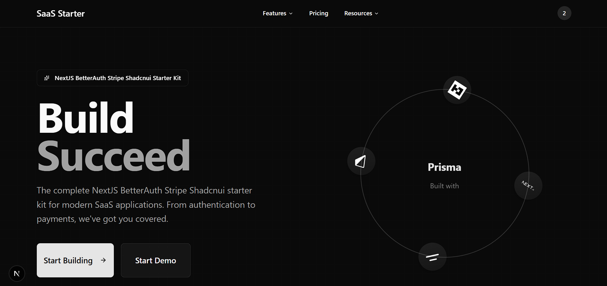

# 🚀 SaaS Starter Kit



A complete SaaS starter kit with **Next.js 15**, **Better Auth**, **Stripe**, and **shadcn/ui**. Get your SaaS running in minutes!

## ✨ Features

- 🚀 **Next.js 15** with App Router
- 🔐 **Better Auth** authentication
- 💳 **Stripe** subscriptions & webhooks
- 🎨 **shadcn/ui** components
- 📊 **Prisma** + PostgreSQL
- 🔒 **TypeScript** throughout

## 🚀 Quick Start

```bash
# Clone and install
git clone <your-repo-url>
cd saas-starter-kit
npm install

# Setup environment
cp .env.example .env.local
# Edit .env.local with your values

# Setup database
npx prisma generate
npx prisma db push

# Run development server
npm run dev
```

Visit [http://localhost:3000](http://localhost:3000) 🎉

## 🧪 Testing

Use Stripe test cards:
- **Success**: `4242 4242 4242 4242`
- **Decline**: `4000 0000 0000 0002`

## 🚀 Deploy

[](https://vercel.com/new/clone?repository-url=https://github.com/yourusername/saas-starter-kit)

1. Fork → Connect to Vercel → Add env vars → Deploy 🎉

## 📋 Environment Variables

Required:
- `DATABASE_URL` - PostgreSQL connection
- `BETTER_AUTH_SECRET` - Auth secret key  
- `STRIPE_SECRET_KEY` - Stripe secret key
- `STRIPE_PUBLISHABLE_KEY` - Stripe publishable key
- `STRIPE_WEBHOOK_SECRET` - Webhook secret
- `STRIPE_*_PRICE_ID` - Price IDs for each plan

## 🆘 Support

- 📧 [minar.svn@gmail.com](mailto:minar.svn@gmail.com)
- 🌐 [shovon.site](https://shovon.site)

---

Built with ❤️ by [Shovon](https://shovon.site)